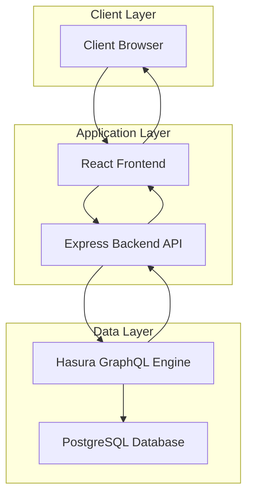
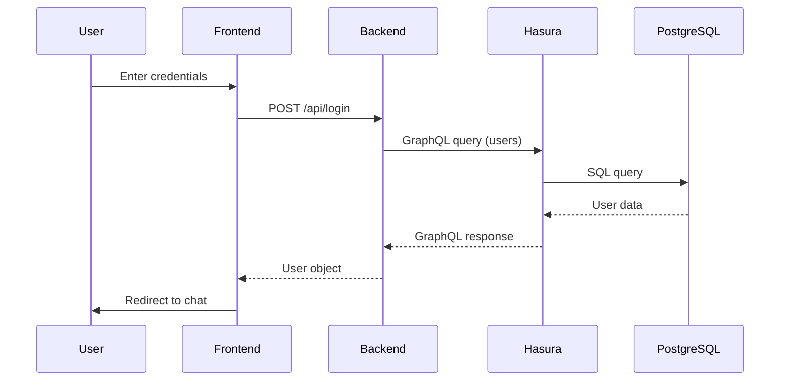
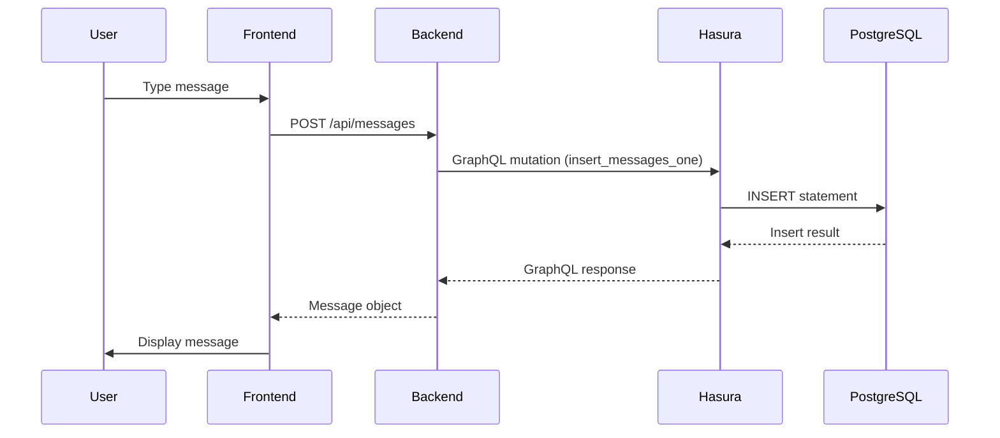
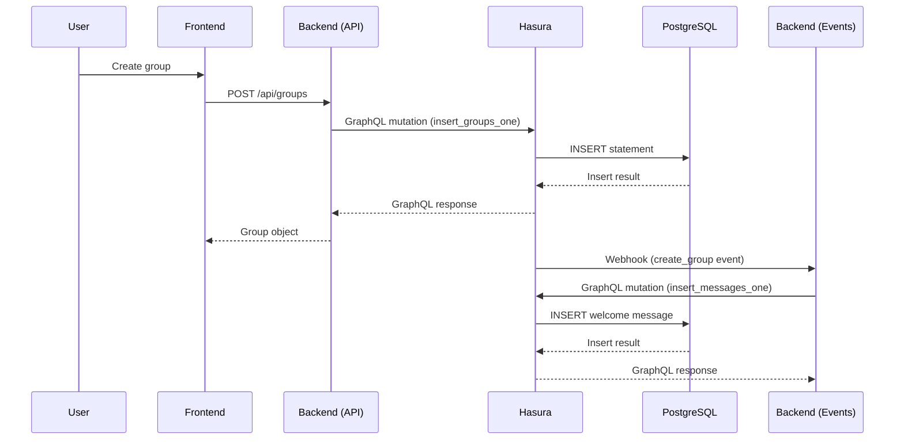
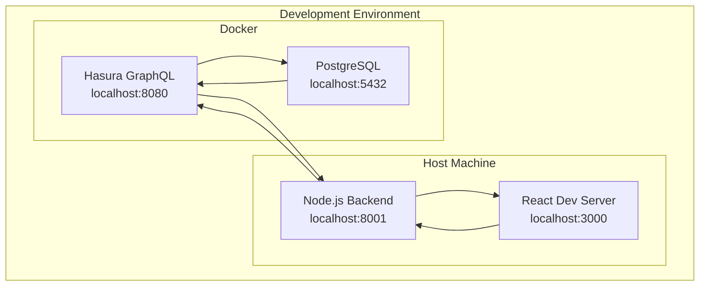

# System Architecture Documentation

This document provides a comprehensive overview of the system architecture for the Hasura Crash Course project.

## High-Level Architecture



## Component Overview

### 1. Client Layer
- **Technology**: Modern web browser
- **Framework**: React with TypeScript
- **Features**: 
  - User authentication (registration/login)
  - Group management (create/view groups)
  - Real-time messaging interface
  - Responsive design

### 2. Application Layer
Consists of two main services:

#### Frontend Service
- **Location**: [frontend/](frontend/)
- **Technology**: React.js with TypeScript
- **Port**: 3000 (development)
- **Responsibilities**:
  - User interface rendering
  - Client-side state management
  - API communication with backend
  - User interaction handling

#### Backend Service
- **Location**: [backend/](backend/)
- **Technology**: Node.js with Express.js
- **Port**: 8001
- **Responsibilities**:
  - Custom business logic implementation
  - REST API endpoints
  - Hasura event webhook processing
  - Authentication handling

### 3. Data Layer
Managed by Docker containers:

#### Hasura GraphQL Engine
- **Location**: Docker container (defined in [docker-compose.yaml](docker-compose.yaml))
- **Technology**: Hasura GraphQL Engine v2.0.1
- **Port**: 8080
- **Responsibilities**:
  - GraphQL API generation from PostgreSQL schema
  - Real-time subscriptions
  - Authorization and permissions
  - Event triggers and webhooks
  - Migration and metadata management

#### PostgreSQL Database
- **Location**: Docker container (defined in [docker-compose.yaml](docker-compose.yaml))
- **Technology**: PostgreSQL 12
- **Port**: 5432
- **Responsibilities**:
  - Data persistence
  - ACID compliance
  - Relationship management
  - Query execution

## Data Flow

### Authentication Flow


### Message Sending Flow


### Group Creation Flow with Event Trigger


## Database Schema

See [DATABASE_SCHEMA.md](DATABASE_SCHEMA.md) for detailed database schema documentation.

## API Endpoints

### Backend REST API
See [BACKEND_SERVICE.md](BACKEND_SERVICE.md) for detailed API documentation.

### Hasura GraphQL API
See [HASURA_API.md](HASURA_API.md) for detailed GraphQL API documentation.

## Deployment Architecture



## Security Considerations

1. **Hasura Admin Secret**: Protects the GraphQL endpoint with `myadminsecretkey`
2. **Environment Variables**: Sensitive configuration stored in `.env` files
3. **CORS**: Configured in backend to allow communication from frontend
4. **Password Storage**: Passwords are stored as hashes (though in a real application, proper hashing should be implemented)

## Scalability Considerations

1. **Horizontal Scaling**: 
   - Frontend can be scaled horizontally behind a load balancer
   - Multiple backend instances can be deployed
   - Hasura supports horizontal scaling with multiple instances

2. **Database Scaling**:
   - PostgreSQL can be scaled vertically
   - For horizontal scaling, consider read replicas or sharding

3. **Caching**:
   - Hasura provides built-in caching mechanisms
   - Redis or similar could be added for application-level caching

## Monitoring and Logging

1. **Hasura Logs**: Configured to log startup, HTTP requests, webhooks, WebSocket connections, and queries
2. **Backend Logs**: Console logging for debugging and monitoring
3. **Docker Logs**: Accessible through `docker-compose logs` command

## Backup and Recovery

1. **Database Backups**: PostgreSQL data is persisted in Docker volumes
2. **Hasura Metadata**: Stored in the database and can be exported/imported
3. **Application Code**: Version controlled in Git

## Development Workflow

1. **Start Database and Hasura**:
   ```bash
   docker-compose up
   ```

2. **Start Backend Service**:
   ```bash
   cd backend
   npm install
   npm start
   ```

3. **Start Frontend Application**:
   ```bash
   cd frontend
   npm install
   npm start
   ```

4. **Access Applications**:
   - Frontend: `http://localhost:3000`
   - Hasura Console: `http://localhost:8080/console`
   - GraphQL Endpoint: `http://localhost:8080/v1/graphql`

## Future Enhancements

1. **Authentication Improvements**:
   - Implement proper password hashing (bcrypt)
   - Add JWT token-based authentication
   - Implement session management

2. **Real-time Features**:
   - Add GraphQL subscriptions for real-time message updates
   - Implement WebSocket connections for instant messaging

3. **Performance Optimizations**:
   - Add database indexing
   - Implement caching strategies
   - Optimize GraphQL queries

4. **Security Enhancements**:
   - Implement rate limiting
   - Add input validation and sanitization
   - Configure proper CORS policies

5. **UI/UX Improvements**:
   - Add user avatars
   - Implement message timestamps
   - Add group member management
   - Implement message editing/deletion