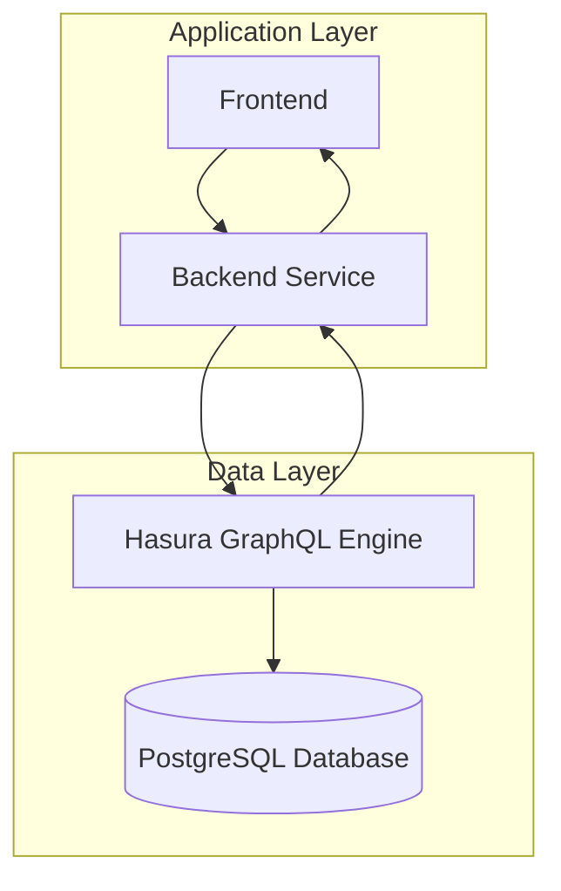

# Backend Service Documentation

This document describes the Express.js backend service that handles custom APIs and event processing.

## Overview

The backend service runs on port 8001 and provides REST APIs for:
- User registration and authentication
- Group management
- Message handling
- Processing Hasura event triggers

## Environment Variables

The service uses the following environment variables defined in [.env](backend/.env):

- `HASURA_ENDPOINT`: The Hasura GraphQL endpoint (e.g., `http://localhost:8080/v1/graphql`)
- `HASURA_ADMIN_SECRET`: The Hasura admin secret for authenticated requests

## API Endpoints

### Authentication

#### Register User
- **Endpoint**: `POST /api/register`
- **Request Body**:
  ```json
  {
    "username": "string",
    "email": "string",
    "password": "string"
  }
  ```
- **Response**: User object or error message

#### Login User
- **Endpoint**: `POST /api/login`
- **Request Body**:
  ```json
  {
    "username": "string",
    "password": "string"
  }
  ```
- **Response**: User object or error message

### Group Management

#### Get All Groups
- **Endpoint**: `GET /api/groups`
- **Response**: Array of group objects

#### Create Group
- **Endpoint**: `POST /api/groups`
- **Request Body**:
  ```json
  {
    "name": "string",
    "description": "string",
    "created_by": "integer"
  }
  ```
- **Response**: Created group object

### Message Handling

#### Get Messages for Group
- **Endpoint**: `GET /api/messages/:groupId`
- **Response**: Array of message objects with usernames

#### Send Message
- **Endpoint**: `POST /api/messages`
- **Request Body**:
  ```json
  {
    "groupId": "integer",
    "senderId": "integer",
    "content": "string",
    "username": "string"
  }
  ```
- **Response**: Created message object with username

### Event Processing

#### Group Created Event
- **Endpoint**: `POST /api/events/group-created`
- **Description**: Receives webhook from Hasura when a new group is created
- **Process**: Automatically creates a welcome message in the new group
- **Response**: Success confirmation

## Architecture Diagram



## Key Components

### Hasura Query Helper
A helper function [queryHasura](backend/index.js#L15-L29) is used to make authenticated GraphQL requests to Hasura:

```javascript
async function queryHasura(query, variables = {}) {
  const response = await fetch(HASURA_ENDPOINT, {
    method: 'POST',
    headers: {
      'Content-Type': 'application/json',
      'x-hasura-admin-secret': HASURA_ADMIN_SECRET
    },
    body: JSON.stringify({
      query,
      variables
    })
  });
  
  return await response.json();
}
```

### Error Handling
All API endpoints include proper error handling with try/catch blocks and appropriate HTTP status codes.

## Integration with Hasura Events

The backend service integrates with Hasura through event triggers:

1. When a group is created in Hasura, it triggers the `create_group` event
2. Hasura sends a webhook to `http://host.docker.internal:8001/api/events/group-created`
3. The backend processes this event by creating a welcome message in the new group
4. The backend responds with a success message to acknowledge the event

This demonstrates how Hasura events can be used to implement custom business logic that extends beyond what's possible with pure GraphQL.

## Starting the Service

To start the backend service:

```bash
cd backend
npm install
npm start
```

The service will be available at `http://localhost:8001`.