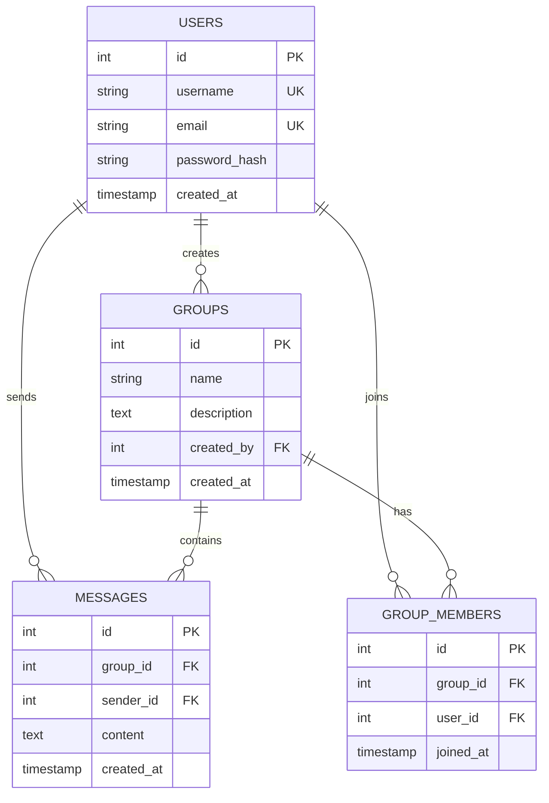

# Database Schema Documentation

This document describes the database schema used in the Hasura Crash Course project.

## Entity Relationship Diagram

## Table Descriptions

### Users Table
Stores user account information.

**Columns:**
- `id` (integer, primary key): Unique identifier for each user
- `username` (varchar(50), unique): User's chosen name for login
- `email` (varchar(100), unique): User's email address
- `password_hash` (varchar(255)): Hashed password for authentication
- `created_at` (timestamp): Timestamp when the user account was created

### Groups Table
Stores chat group information.

**Columns:**
- `id` (integer, primary key): Unique identifier for each group
- `name` (varchar(100)): Name of the group
- `description` (text): Description of the group's purpose
- `created_by` (integer, foreign key): References the user who created the group
- `created_at` (timestamp): Timestamp when the group was created

### Messages Table
Stores messages sent in groups.

**Columns:**
- `id` (integer, primary key): Unique identifier for each message
- `group_id` (integer, foreign key): References the group the message belongs to
- `sender_id` (integer, foreign key): References the user who sent the message
- `content` (text): The content of the message
- `created_at` (timestamp): Timestamp when the message was sent

### Group Members Table
Tracks which users belong to which groups.

**Columns:**
- `id` (integer, primary key): Unique identifier for each membership record
- `group_id` (integer, foreign key): References the group
- `user_id` (integer, foreign key): References the user
- `joined_at` (timestamp): Timestamp when the user joined the group

## Relationships

1. **Users → Groups**: One-to-many relationship. A user can create multiple groups.
2. **Users → Messages**: One-to-many relationship. A user can send multiple messages.
3. **Users → Group Members**: One-to-many relationship. A user can be a member of multiple groups.
4. **Groups → Messages**: One-to-many relationship. A group can contain multiple messages.
5. **Groups → Group Members**: One-to-many relationship. A group can have multiple members.

## Constraints

- Unique constraints on `username` and `email` in the Users table
- Foreign key constraints to maintain referential integrity
- Cascade delete on group memberships and messages when a group is deleted
- Cascade delete on messages and group memberships when a user is deleted