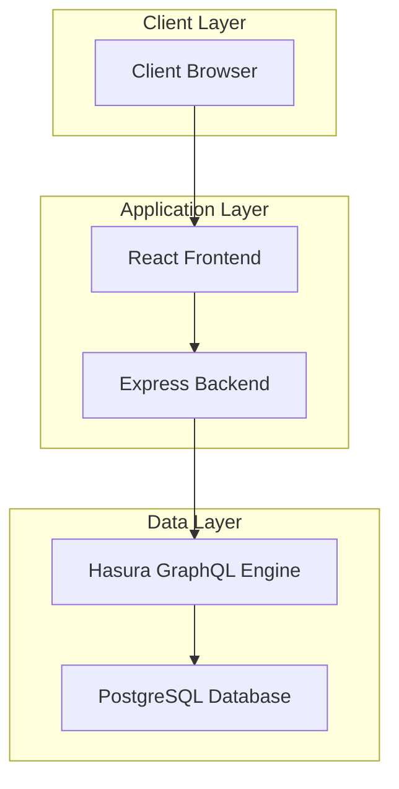

# Project Documentation

This repository contains comprehensive documentation for the Hasura Crash Course project, covering all aspects of the system architecture, components, and implementation details.

## Table of Contents

1. [Project Structure](PROJECT_STRUCTURE.md) - Overview of the project directory structure and components
2. [Database Schema](DATABASE_SCHEMA.md) - Detailed documentation of the PostgreSQL database schema and relationships
3. [Hasura API](HASURA_API.md) - Documentation of the Hasura GraphQL API configuration and endpoints
4. [Backend Service](BACKEND_SERVICE.md) - Documentation of the Express.js backend service
5. [Frontend Application](FRONTEND_APPLICATION.md) - Documentation of the React frontend application
6. [Docker Deployment](DOCKER_DEPLOYMENT.md) - Documentation of the Docker configuration and deployment process
7. [System Architecture](SYSTEM_ARCHITECTURE.md) - Comprehensive overview of the entire system architecture

## System Overview

The Hasura Crash Course project is a chat application that demonstrates the integration of several modern technologies:

- **Frontend**: React with TypeScript for the user interface
- **Backend**: Node.js with Express for custom business logic
- **API Layer**: Hasura GraphQL Engine for data access
- **Database**: PostgreSQL for data persistence
- **Deployment**: Docker Compose for containerized deployment

## Key Features

1. **User Authentication**: Registration and login functionality
2. **Group Management**: Create and view chat groups
3. **Messaging**: Send and receive messages within groups
4. **Real-time Events**: Automatic welcome messages when groups are created
5. **Responsive Design**: Works on desktop and mobile devices

## Architecture Diagram



## Getting Started

### Prerequisites

- Docker and Docker Compose
- Node.js and npm
- Git

### Running the Application

1. **Start the database and Hasura**:
   ```bash
   docker-compose up
   ```

2. **Start the backend service**:
   ```bash
   cd backend
   npm install
   npm start
   ```

3. **Start the frontend application**:
   ```bash
   cd frontend
   npm install
   npm start
   ```

4. **Access the applications**:
   - Frontend: `http://localhost:3000`
   - Hasura Console: `http://localhost:8080/console`

## Documentation Structure

Each documentation file focuses on a specific aspect of the system:

- **[PROJECT_STRUCTURE.md](PROJECT_STRUCTURE.md)**: Provides an overview of how the project is organized
- **[DATABASE_SCHEMA.md](DATABASE_SCHEMA.md)**: Details the database tables, relationships, and constraints
- **[HASURA_API.md](HASURA_API.md)**: Documents the GraphQL API and Hasura configuration
- **[BACKEND_SERVICE.md](BACKEND_SERVICE.md)**: Covers the Express.js backend implementation
- **[FRONTEND_APPLICATION.md](FRONTEND_APPLICATION.md)**: Explains the React frontend implementation
- **[DOCKER_DEPLOYMENT.md](DOCKER_DEPLOYMENT.md)**: Describes the Docker setup and deployment
- **[SYSTEM_ARCHITECTURE.md](SYSTEM_ARCHITECTURE.md)**: Provides a comprehensive view of the entire system

## Technologies Used

- **Frontend**: React, TypeScript, CSS
- **Backend**: Node.js, Express.js
- **Database**: PostgreSQL
- **API Layer**: Hasura GraphQL Engine
- **Deployment**: Docker, Docker Compose
- **Documentation**: Markdown, Mermaid diagrams

## Contributing

This documentation is intended to help developers understand the project structure and implementation details. Feel free to suggest improvements or additions to make it more comprehensive.