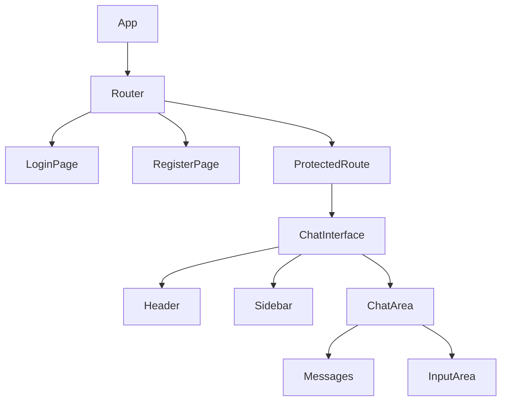

# Frontend Application Documentation

This document describes the React frontend application for the chat interface.

## Overview

The frontend is a React application built with TypeScript that provides a chat interface with the following features:
- User authentication (login)
- Group management (view and create groups)
- Real-time messaging within groups
- Responsive design

## Environment Variables

The frontend uses the following environment variable defined in [.env](frontend/.env):

- `REACT_APP_BACKEND_URL`: The base URL for the backend service (e.g., `http://localhost:8001`)

## Project Structure

```
frontend/
├── public/
│   ├── index.html          # Main HTML template
│   └── ...                 # Other static assets
├── src/
│   ├── App.css             # Main stylesheet
│   ├── App.tsx             # Main application component
│   ├── Login.tsx           # Login component
│   ├── interfaces.ts       # TypeScript interfaces
│   └── ...
├── package.json            # Dependencies and scripts
└── tsconfig.json           # TypeScript configuration
```

## Components

### App Component ([App.tsx](frontend/src/App.tsx))

The main application component manages the overall state and functionality:

#### State Management
- `currentUser`: Currently logged-in user
- `messages`: Messages in the current group
- `newMessage`: Content of the new message being composed
- `currentGroup`: ID of the currently selected group
- `groups`: List of all available groups
- `showCreateGroup`: Visibility state of the create group form
- `newGroupName`: Name for a new group being created
- `newGroupDescription`: Description for a new group being created

#### Key Features
1. **User Authentication**: Renders the [Login](#login-component) component when no user is logged in
2. **Group Management**: Fetches and displays groups, allows creating new groups
3. **Messaging**: Fetches and displays messages, allows sending new messages
4. **Real-time Updates**: Refreshes messages when switching groups

### Login Component ([Login.tsx](frontend/src/Login.tsx))

Handles user authentication with registration and login forms:

#### Features
- Registration form with username, email, and password fields
- Login form with username and password fields
- Form validation and error handling
- API integration with backend authentication endpoints

### Interfaces ([interfaces.ts](frontend/src/interfaces.ts))

Defines TypeScript interfaces for type safety:

```typescript
interface User {
  id: number;
  username: string;
  email: string;
}

interface Group {
  id: number;
  name: string;
  description: string;
  created_by: number;
  created_at: string;
}

interface Message {
  id: number;
  group_id: number;
  sender_id: number;
  content: string;
  created_at: string;
  username?: string;
}
```

## Data Flow Diagram

```
graph TD
    A[User Interface] --> B[App Component]
    B --> C[Backend API]
    C --> D[Hasura GraphQL]
    D --> E[PostgreSQL]
    E --> D
    D --> C
    C --> B
    B --> A
    
    subgraph Frontend
        A
        B
    end
    
    subgraph Backend
        C
    end
    
    subgraph Hasura
        D
    end
    
    subgraph Database
        E
    end
```

## API Integration

The frontend communicates with the backend service through REST API calls:

### Authentication
- `POST /api/register`: User registration
- `POST /api/login`: User authentication

### Group Operations
- `GET /api/groups`: Fetch all groups
- `POST /api/groups`: Create a new group

### Message Operations
- `GET /api/messages/:groupId`: Fetch messages for a group
- `POST /api/messages`: Send a new message

## Styling

The application uses plain CSS for styling with a clean, minimal design:

- Sidebar for group navigation
- Main chat area for messages
- Responsive layout that works on different screen sizes
- Simple color scheme with clear visual hierarchy

## Starting the Application

To start the frontend application:

```bash
cd frontend
npm install
npm start
```

The application will be available at `http://localhost:3000`.

## Build Process

To build the application for production:

```bash
cd frontend
npm run build
```

This creates an optimized production build in the `build/` directory.

# Frontend Application Structure

## Overview
The frontend application has been restructured to use proper routing and component-based architecture for better organization and scalability.

## Component Structure


## Routing Structure
- `/` - Login page (redirects to groups if already logged in)
- `/login` - Login page
- `/register` - Registration page
- `/groups` - Main chat interface with groups sidebar
- `/group/:id` - Specific group chat (same interface, different group selected)

## Key Features
1. **Responsive Design**: Sidebar transforms into a hamburger menu on mobile devices
2. **Component-Based Architecture**: Each UI element is a separate reusable component
3. **Proper Routing**: Different pages for login, registration, and chat interface
4. **Protected Routes**: Authentication required for chat interface
5. **Unified Chat Interface**: Single interface for all group chats with persistent sidebar

## Components
- **Header**: Contains navigation links and logout functionality
- **Sidebar**: Displays list of groups with create group functionality (always visible)
- **ChatArea**: Combines messages display and input area
- **Messages**: Displays chat messages
- **InputArea**: Handles message input and submission
- **LoginPage**: User authentication
- **RegisterPage**: New user registration
- **ChatInterface**: Main chat interface with groups sidebar and dynamic content area
- **ProtectedRoute**: Wrapper for authenticated routes

## Responsive Behavior
- On desktop: Sidebar is always visible on the left
- On mobile: Sidebar is hidden by default and accessible via hamburger menu
- Smooth transitions for sidebar open/close animations

## Navigation Flow
1. User logs in or registers
2. User is redirected to `/groups` which shows a welcome message and the groups sidebar
3. User clicks on a group in the sidebar to navigate to `/group/:id`
4. The same ChatInterface component is used for both routes, but displays different content based on the selected group
5. The sidebar remains fixed and always shows all groups
